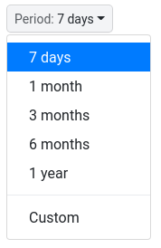

# RangeSelector

`RangeSelector` component provides dropdown menus to enable user pick certain
time interval. See screenshot below:



## Usage

See example code below:

```html
<template>
  <RangeSelector
    ref="range-selector"
    size="sm"
    custom-enabled
    :selected="period"
    :items="rangeSelector"
    :max-custom-duration="maxCustomDuration"
    @period-selected="onPeriodChange"
  />
</template>

<script>
  import RangeSelector from '@/components/range-selector'

  export default {
    name: 'MyComponent',
    components: {
      RangeSelector,
    },
    data() {
      return {
        period: {
          count: 7,
          type: 'day',
          text: '7 days',
        },
        rangeSelector: [
          {
            count: 7,
            type: 'day',
            text: '7 days',
          },
          {
            count: 1,
            type: 'month',
            text: '1 month',
          },
          {
            count: 3,
            type: 'month',
            text: '3 months',
          },
          {
            count: 6,
            type: 'month',
            text: '6 months',
          },
          {
            count: 1,
            type: 'year',
            text: '1 year',
          },
        ],
        maxCustomDuration: {
          count: 4,
          type: 'years',
        },
      }
    },
    methods: {
      onPeriodChange(period, { startTime, endTime }) {
        console.log(period, startTime, endTime)
      },
    },
  }
</script>
```

## Period Entry

Each period in range selector entries are object type with the following
attributes:

| Name  | Type   | Description                                                                      |
| ----- | ------ | -------------------------------------------------------------------------------- |
| count | Number | Integer number indicating period count                                           |
| type  | String | Period type. Valid values are `second`, `minute`, `hour`, `day`, `month`, `year` |
| text  | String | Text label to display in dropdown menu                                           |

## Props

- items

  - Type: `Array`

  - Default: `[]`

  - Description:

    Range selector entries.

- selected

  - Type: `Number|Array`

  - Default: `null`

  - Description:

    Initial selected entries. If type is Number, then it will get the period
    index from range selector entries.

- custom-enabled

  - Type: `Boolean`

  - Default: `false`

  - Description:

    Enable to pick custom date interval in dropdown menu.

- custom-text

  - Type: `String`

  - Default: `Custom`

  - Description:

    Custom text to use in custom date interval picker.

- max-custom-duration

  - Type: `Object`

  - Default: `null`

  - Description:

    Maximum custom duration interval. Example entry is:

    ```js
        {
            count: 2,
            type: 'years'
        }
    ```

    `type` property can be any valid moment
    [duration](https://momentjs.com/docs/#/durations/) unit of measurement.

`RangeSelector` is built with BootstrapVue dropdown component. See [BootstrapVue
dropdown documentation](https://bootstrap-vue.org/docs/components/dropdown) for
more information.

## Events

- period-selected

  - Payloads:

    - `{Object} period`

      Period object.

    - `{Object} {startTime, endTime}`

      Object containing `startTime` and `endTime` with type of moment object.

  - Description:

    Triggered when user click certain period in the dropdown menu or user has
    picked custom period.
